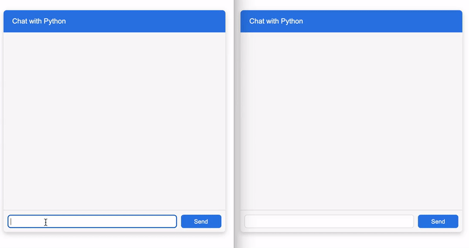

# Python WebSockets from Scratch (WIP)

Threaded WebSocket Server that is very compact, has no external dependencies and can handle text messages

#### Example: Chat Application


- In terminal `python chat.py [port]` (starts on port 8000 by default)
- Open index.html on two different tabs
- Type anything in the chat

#### API
Module has several API calls

| Method | Description |
| :--- | :--- |
| `send(client, message)` | Send text message to the client |
| `sendall(message)` | Send text message to all clients |
| `onmessage(callback)` | New message, user-defined callback function must take two arguments: client and message |
| `onopen(callback)` | Client connected, user-defined callback function must take one argument: client |
| `onclose(callback)` | Client left, user-defined callback function must take one argument: client |
| `close(client)` | Kick client out |
| `shutdown()` | Shutdown server |
| `clients` | List all current clients on the server where each client is a socket |

#### Basic Server
````py
from ws import WSServer

# By default server will start on port 8000
# and will accept connections from any host
# Optionally, you can use secure TLS-connection
server = WSServer(host='', port=8000, cert=None, key=None)

# User defined callback function for handling incoming messages
# It must take two arguments:
#  - client, which is a socket that came from user
#  - message, already decoded in user-friendly utf-8
def incomimg_message(client, message):
	# Send text message to all clients
	server.sendall(message)

# Register callback function that will react everytime
# server got new message
server.onmessage(incoming_message)

# Start server, takes no arguments
server.run()

````

#### Requirements
- Python 3.7+


#### TODO

- Handle binary data
- Exit client gracefully
- Handle errors

#### References
- Comprehensive, but difficult to understand (Internet Engineering Task Force (IETF)): [The WebSocket Protocol](https://datatracker.ietf.org/doc/html/rfc6455)
- User friendly documentation on Mozilla: [The WebSocket API (WebSockets)](https://developer.mozilla.org/en-US/docs/Web/API/WebSockets_API)
